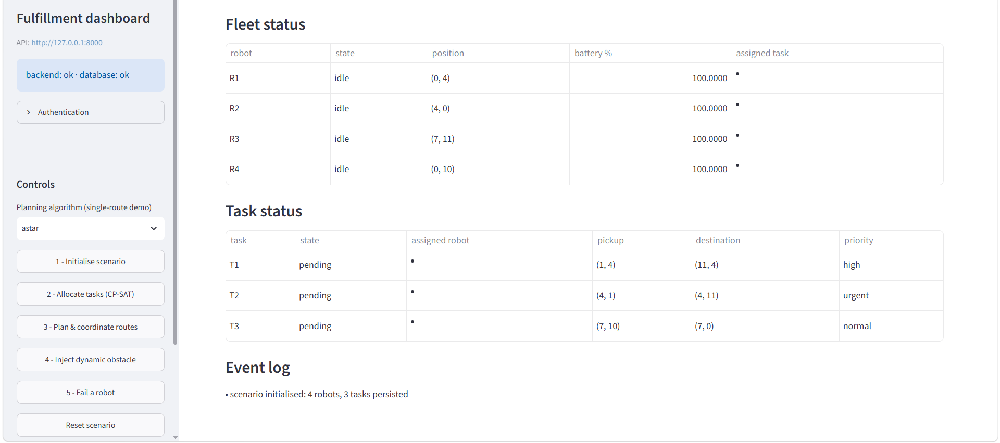
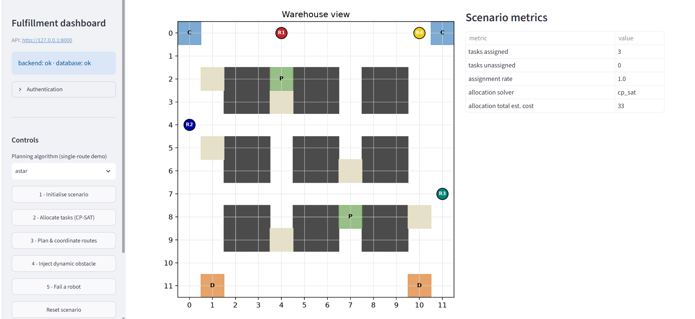
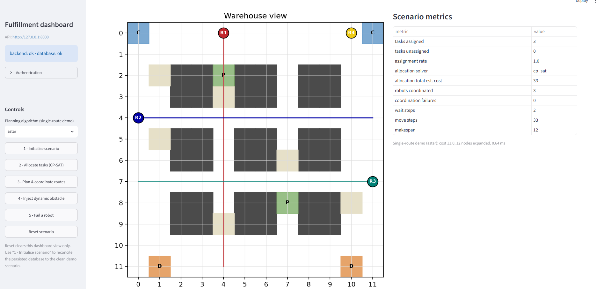
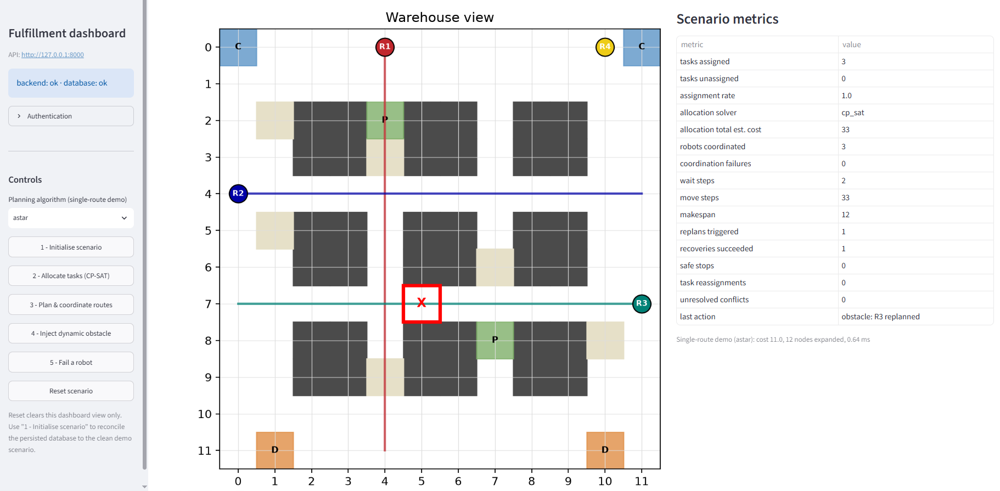
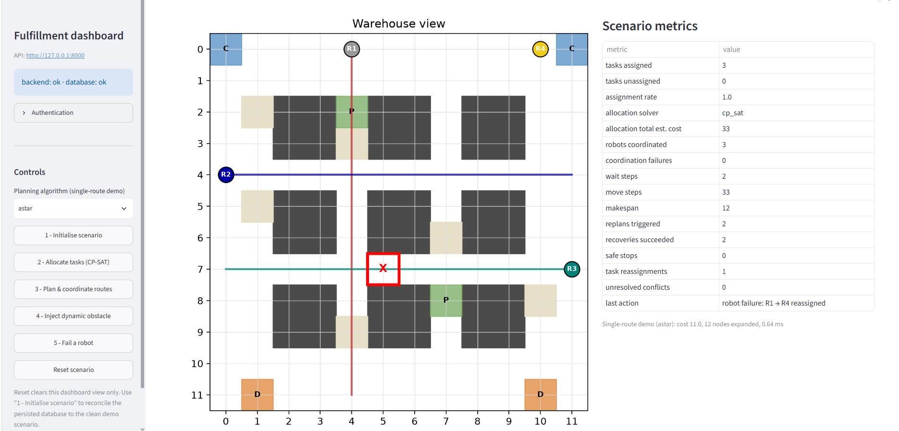
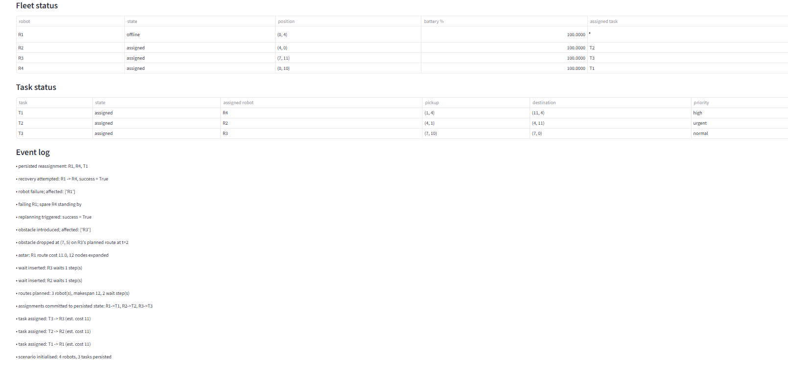

# Autonomous Multi-Robot Fulfillment & Dynamic Path Planning System

A deterministic, fully simulated multi-robot warehouse-fulfillment system. It
plans routes for a fleet of grid robots, allocates delivery tasks with a
constraint solver, coordinates the fleet in space **and** time to avoid
collisions, repairs plans when obstacles appear or robots fail mid-run, and
exposes the whole pipeline over an authenticated REST API backed by PostgreSQL.
A Streamlit dashboard drives the system end to end for demonstration.

This is a software-engineering and algorithms project — not a deployed robotics
platform. Every capability described below is implemented in this repository and
covered by an automated test suite (**813 tests, 0 skipped** with PostgreSQL
configured).

**At a glance**

- A\* and Dijkstra grid path planning, implemented from first principles, with an independent path validator
- OR-Tools CP-SAT task allocation with a deterministic greedy baseline
- Prioritized space-time fleet coordination: reservation table, WAIT insertion, conflict-free by construction
- Dynamic-obstacle replanning and robot-failure recovery with task reassignment, or an honest safe stop
- FastAPI service, SQLAlchemy/PostgreSQL persistence, Alembic migrations, JWT auth (viewer / operator / admin)
- Structured JSON logging with per-request correlation ids; secrets never logged
- Reproducible benchmark suite with a consolidated evaluation report
- GitHub Actions workflow: full test suite against a real PostgreSQL service container; container image build
- Streamlit visualization dashboard (HTTP client only — contains no algorithm code)

## Table of Contents

- [Overview](#overview)
- [System Architecture](#system-architecture)
- [Core Capabilities](#core-capabilities)
- [Technology Stack](#technology-stack)
- [System Demo](#system-demo)
  - [1. Scenario Initialization](#1-scenario-initialization)
  - [2. CP-SAT Task Allocation](#2-cp-sat-task-allocation)
  - [3. Multi-Robot Route Coordination](#3-multi-robot-route-coordination)
  - [4. Dynamic Obstacle Replanning](#4-dynamic-obstacle-replanning)
  - [5. Robot Failure Recovery](#5-robot-failure-recovery)
  - [6. Persisted Task Reassignment](#6-persisted-task-reassignment)
- [Benchmarks](#benchmarks)
- [API and Persistence](#api-and-persistence)
- [Testing and CI](#testing-and-ci)
- [Running Locally](#running-locally)
- [Known Limitations](#known-limitations)

## Overview

The system models a 2D warehouse grid with static racks, dynamic obstacles,
pickup / drop-off / charging cells, and a fleet of four-directional robots with
battery and payload limits. A fulfillment request flows through a fixed
pipeline:

1. **Task allocation** — assign pending tasks to idle robots to minimize total estimated travel.
2. **Path planning** — shortest routes for individual robots.
3. **Coordination** — replan the fleet in space-time so no two robots occupy the same cell or edge at the same step.
4. **Recovery** — when an obstacle appears or a robot goes offline mid-run, repair the affected part of the plan, reassign a stranded task if a spare robot exists, or stop safely.
5. **Service and persistence** — every step is callable over HTTP; fleet state and run history persist in PostgreSQL.

Everything is deterministic: fixed random seeds and ordered tie-breaks mean the
same inputs always produce the same plan, which is what makes the tests and
benchmarks meaningful.

## System Architecture

```
Pending tasks + idle robots
        |
        v
Task allocation            greedy baseline / OR-Tools CP-SAT
        |
        v
Path planning               A* / Dijkstra over the warehouse grid
        |
        v
Multi-robot coordination    prioritized Space-Time A* + reservation table
        |
        v
Recovery / replanning       detect disruption -> repair affected subset -> re-validate
        |
        v
Service + persistence       FastAPI -> services -> SQLAlchemy -> PostgreSQL
        |
        v
Dashboard                   Streamlit (HTTP client only)
```

Layering rules the codebase enforces:

- **API layer** (`robotics/api/`) — parse, validate, shape responses. No algorithms.
- **Service layer** (`robotics/services/`) — orchestrate one operation; owns the per-request transaction. No SQL, no algorithms.
- **Persistence layer** (`robotics/persistence/`) — SQLAlchemy engine, ORM models, repositories. No domain logic.
- **Algorithm packages** (`planning`, `allocation`, `coordination`, `recovery`) — pure; no knowledge of HTTP or the database.
- **Dashboard** (`frontend/`) — communicates with the system only through the REST API.

## Core Capabilities

**Simulation** — deterministic 2D warehouse grid (`(row, col)`, four-directional,
unit cost); static and dynamic obstacles tracked separately; robots with
battery, payload and status; explicit task lifecycle
(`PENDING → ASSIGNED → IN_PROGRESS → COMPLETED`, plus `FAILED`); every move
validated for bounds, adjacency, obstacles, occupancy and battery.

**Path planning** — A\* (Manhattan heuristic) and Dijkstra, from first
principles with `heapq`, deterministic tie-break, and an independent validator
that re-checks every returned path.

**Task allocation** — `CostEstimator` prices each robot→task pair as
`A*(robot → pickup) + A*(pickup → dropoff)`; a deterministic `GreedyAllocator`
baseline; and `CpSatAllocator`, a 0/1 assignment model solved with OR-Tools
CP-SAT (maximize assignments, then minimize travel, then break ties by id).
Allocators mutate nothing — a commit is dry-run checked and applied
all-or-nothing.

**Coordination** — `TimedPath` and a `ReservationTable` (vertex + edge
reservations, goal holds); Space-Time A\* with a WAIT action;
`MultiRobotCoordinator` plans robots in a fixed priority order, each reserving
its route before the next, so plans are conflict-free by construction (and
partial when a robot cannot be placed). Synchronized timestep execution is
validate-first / commit-second, with an independent conflict validator over the
executed trace.

**Recovery** — detects a dynamic obstacle or an offline robot mid-run; replans
only the affected robots from their current position, widening to re-coordinate
a subset only when a narrower repair would not be conflict-free. A failed
robot's `ASSIGNED` task is reassigned to a feasible spare through the existing
allocator (an `IN_PROGRESS` task fails honestly), and a successful reassignment
is written back to persisted state. When repair is impossible, the run reports a
safe stop.

**Service, persistence, auth** — FastAPI endpoints for every algorithm plus
robot / task CRUD; SQLAlchemy on PostgreSQL (SQLite for tests) across 7 tables;
one transaction per request (commit on success, rollback on exception); Alembic
migrations with `alembic check` in CI; JWT auth (HS256) with three roles and
bcrypt hashing, keeping `401` and `403` distinct; `/health` (no DB) and
`/ready` (`SELECT 1`); structured JSON logs with per-request correlation ids and
no secret ever logged; creation races resolved by `UNIQUE` constraints.

**Tooling** — reproducible benchmark scripts with a consolidated
`run_final_evaluation.py`; a GitHub Actions workflow (tests against a PostgreSQL
service container, Docker image build); a Streamlit demo dashboard.

## Technology Stack

| Area | Tools |
|---|---|
| Language | Python 3.11 |
| Algorithms | Standard library only; OR-Tools CP-SAT for task allocation |
| Service | FastAPI, Uvicorn, Pydantic / pydantic-settings |
| Persistence | SQLAlchemy 2, PostgreSQL (psycopg 3); SQLite for tests |
| Migrations | Alembic |
| Auth | PyJWT, bcrypt |
| Dashboard | Streamlit, Matplotlib |
| Testing | pytest |
| CI / packaging | GitHub Actions; Dockerfile + docker-compose (build-validated in CI, not run locally) |

## System Demo

The six screenshots below walk through one **deterministic** dashboard scenario:
**4 robots, 3 tasks**, with R4 kept as a spare. The metrics shown are specific to
this scenario, not general performance claims.

### 1. Scenario Initialization



The fixed demo scenario is created and persisted: four robots (R1–R4), three
pending tasks (T1–T3), and the warehouse layout (racks, pickup / drop-off /
charging cells).

### 2. CP-SAT Task Allocation



CP-SAT assigns all three tasks (R1→T1, R2→T2, R3→T3) at an estimated total cost
of 33 for this scenario, leaving R4 idle as a genuine spare. The assignment rate
is 1.0 **for this scenario** — not a universal figure.

### 3. Multi-Robot Route Coordination



The three assigned robots are coordinated into conflict-free timed routes:
makespan 12, 33 move steps, 2 inserted wait steps (the event log shows the waits
on R2 and R3), and 0 coordination failures. A single-route A\* demonstration is
shown alongside. Prioritized planning is not globally optimal or complete.

### 4. Dynamic Obstacle Replanning



A dynamic obstacle is injected onto R3's planned route. Replanning is triggered
and reported as successful, with 0 safe stops and 0 unresolved conflicts for
this run. The dashboard retains the previously drawn route geometry, so this
image demonstrates obstacle injection, the recovery state, metrics, and event
logging — not necessarily the complete redrawn post-obstacle trajectory.

### 5. Robot Failure Recovery



R1 is taken offline mid-run. Recovery is triggered and succeeds: R1's task is
reassigned and R4 (the spare) becomes the replacement robot, with 0 unresolved
conflicts for this run.

### 6. Persisted Task Reassignment



The reassignment is written back to authoritative state: R1 = offline,
R4 = assigned, T1 → R4, while R2→T2 and R3→T3 are unchanged. The event log
records the recovery and the persisted reassignment. This shows the state
transition and its persistence — not a full physical execution of T1 to
completion.

## Benchmarks

All scenarios are generated from fixed seeds and reproduce on any machine.
**Logical metrics** (node counts, path costs, conflict counts, success rates,
integrity booleans) are deterministic; **latency and throughput figures are
in-process and machine-dependent — they are not production numbers.** Full
methodology, definitions and baselines: [`docs/evaluation.md`](docs/evaluation.md).
Reproduce: `python benchmarks/run_final_evaluation.py --postgres`.

| Area | Result | Baseline / scope |
|---|---|---|
| Path planning | A\* expanded **~90.6% fewer nodes** than Dijkstra (median per-scenario ratio ≈ 0.09); **100%** optimal-cost agreement; A\* fewer in **106 / 106** solved scenarios | vs Dijkstra (same search, `h = 0`); 108 scenarios, 106 solvable |
| Task allocation | CP-SAT cut total estimated fleet travel **~22.9%** on same-cardinality scenarios (**31 / 32** strictly cheaper, 0 worse) | vs greedy nearest-feasible; 40 scenarios, 32 same-cardinality |
| Coordination | **0 unresolved** vertex/edge conflicts across **749** faced; "all robots reach goal" **34.8% → 86.4%** | vs independent sequential execution; 118 scenarios, fleets up to 20 |
| Dynamic replanning (obstacle) | **73.3%** replan success; obstacle-scenario goal completion **60.5% → 84.8%**; **0** unresolved conflicts | recovery off vs on; 47 obstacle scenarios (some deliberately unrecoverable) |
| Failure recovery | **59.3%** overall recovery; stranded-task reassignment **35 / 35** where a spare exists; recoverable-subset goal completion **83.5% → 99.8%**; **0** unresolved conflicts, **0** duplicate task completions | recovery off vs on; 71 failure scenarios (36 with no spare, counted as failures) |
| Service | 100% success over **360** in-process requests | FastAPI TestClient, PostgreSQL 18.4 |
| Concurrency | **480 / 480** ops ok; 24-thread create race → 1×`201` / 23×`409` / 0×`5xx` / 1 row; fleet planning byte-identical sequential vs thread pool | in-process ASGI, PostgreSQL 18.4 |

Prioritized coordination is **not** globally optimal or complete: dense
bidirectional corridors with 10–20 robots have a 0% planning success rate in the
benchmark and are reported as failures, not hidden. The ~59% overall recovery
rate is conservative by design — 36 of the 71 failure scenarios have no spare
robot and are counted as recovery failures; on the recoverable subset the rate
is ~99.8%. "Conflict-free" means *0 unresolved conflicts across the deterministic
benchmark runs*, not a real-world guarantee.

## API and Persistence

FastAPI sits over the algorithm stack; SQLAlchemy sits over PostgreSQL. Selected
endpoints (everything except health and the token endpoints requires
`Authorization: Bearer <jwt>`):

| Endpoint | Purpose | Role |
|---|---|---|
| `GET /health` · `GET /ready` | liveness / database readiness | public |
| `POST /auth/token` · `POST /auth/login` · `GET /auth/me` · `POST /auth/register` | issue a JWT / read own identity / register a user | public · authenticated · admin |
| `GET·POST·PATCH·DELETE /robots` · `.../tasks` | fleet and task records; task transitions are state-machine checked | viewer / operator |
| `POST /planning/path` | run A\* / Dijkstra between two cells | operator |
| `POST /allocation/run` | run greedy / CP-SAT; optionally commit assignments to persisted state | operator |
| `POST /coordination/plan` | run the prioritized space-time coordinator for a fleet | operator |
| `POST /recovery/obstacle` · `POST /recovery/robot-failure` | apply a disruption through the recovery layer; `robot-failure` can commit a successful reassignment | operator |

Errors use one body shape (`{"error", "message", "details"?}`) with the status
chosen per exception category (`401` / `403` / `404` / `409` / `422` / `503` /
`500`). A legitimate domain "no" — no route, no feasible allocation, recovery
impossible — is a normal `200` with `success: false` / `safe_stop: true`, not an
error.

**Persistence:** 7 tables — `users`, `robots`, `tasks`, and append-only
`planning_runs` / `allocation_runs` / `coordination_runs` / `recovery_events`.
Each request runs in a single transaction (commit on success, rollback on
exception). Alembic owns the schema in production; `alembic check` runs in CI.
All configuration comes from the environment or a git-ignored `.env` (see
[`.env.example`](.env.example)); no secret is hard-coded or logged.

## Testing and CI

| Command | Result |
|---|---|
| `pytest` (SQLite only) | **791 passed, 22 skipped** (the PostgreSQL-only tests) |
| `pytest` with `TEST_DATABASE_URL` set | **813 passed, 0 skipped** |

The suite is deterministic — no test sleeps. It covers the domain model, both
planners, allocation, coordination, recovery, the full API, authentication and
authorization, transactions and rollback, concurrency (SQLite and real
PostgreSQL), structured-logging secret-absence, and the dashboard's non-UI
logic. The PostgreSQL integration tests apply the real Alembic migrations and
exercise CRUD round trips, the `ON DELETE SET NULL` foreign key,
unique-constraint and rollback behaviour, and transaction isolation under
concurrency.

**CI** — `.github/workflows/ci.yml` is configured to run, on every push and pull
request, the full test suite against a PostgreSQL 18 service container (after
`alembic upgrade head` and `alembic check`) plus an app-startup smoke check, and
to build the Docker image (no push — there is no deployment target). Docker is
not run on the development machine; the Compose stack is validated statically and
built in CI only.

## Running Locally

Requires Python 3.11 (used for development and set in the CI workflow).

Create the virtual environment:

```bash
python -m venv .venv
```

Three commands are platform-specific — activate the environment, create your
`.env`, and (later) point the dashboard at the API:

| Step | macOS / Linux | Windows PowerShell |
|---|---|---|
| Activate the venv | `source .venv/bin/activate` | `.\.venv\Scripts\Activate.ps1` |
| Create `.env` from the template | `cp .env.example .env` | `Copy-Item .env.example .env` |
| Point the dashboard at the API | `export FULFILLMENT_API_URL=http://127.0.0.1:8000` | `$env:FULFILLMENT_API_URL = "http://127.0.0.1:8000"` |

Everything else is the same on all platforms:

```bash
pip install -r requirements.txt
alembic upgrade head                                    # PostgreSQL target
uvicorn robotics.api.app:create_app --factory --reload  # API — docs at http://127.0.0.1:8000/docs
streamlit run frontend/app.py                           # dashboard, in a second terminal
```

Edit `.env` to set `DATABASE_URL` and `JWT_SECRET_KEY` (see
[`.env.example`](.env.example) for every option), and
`BOOTSTRAP_ADMIN_USERNAME` / `BOOTSTRAP_ADMIN_PASSWORD` for a first login. Never
commit real values — `.env` is git-ignored. With no `.env`, the app uses a local
SQLite file and needs zero external setup.

**Other entry points** (no server or database required):

```bash
python scripts/run_system_demo.py            # narrated end-to-end walkthrough
python benchmarks/run_final_evaluation.py    # consolidated benchmark evaluation
```

## Known Limitations

- **Simulation only.** No physical robots, no hardware-in-the-loop, no real-time control guarantees.
- **Prioritized coordination is not globally optimal or complete.** A poor priority order can make a solvable instance fail; dense bidirectional corridors with large fleets are not solved.
- **Conflict-free and recovery figures are scoped to the deterministic benchmark runs**, not the real world.
- **Recovery is partial by design.** An `IN_PROGRESS` task on a failed robot is failed honestly, not handed off; a "human clears the robot" event is not modeled; the pick / drop / complete execution steps are not implemented (execution stops at the coordinated goal).
- **The dashboard recovery view** retains previously computed route geometry rather than redrawing the full post-recovery trajectory.
- **Service and concurrency benchmarks are in-process** measurements of wrapper overhead — not production latency, throughput, or load-test results.
- **The Docker image is build-validated in CI only** — not run on the development machine and not deployed anywhere.
- **The GitHub Actions workflow is configured** for automated testing and container-build validation; its execution history on GitHub is not asserted here.
